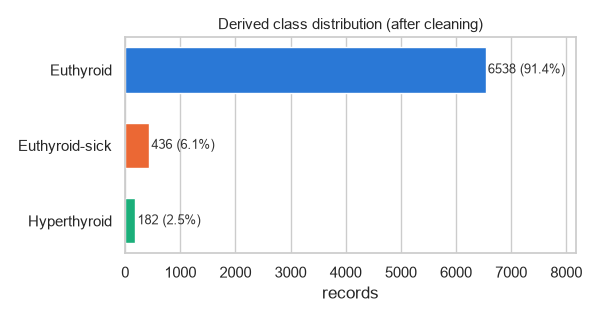
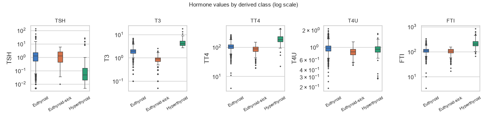
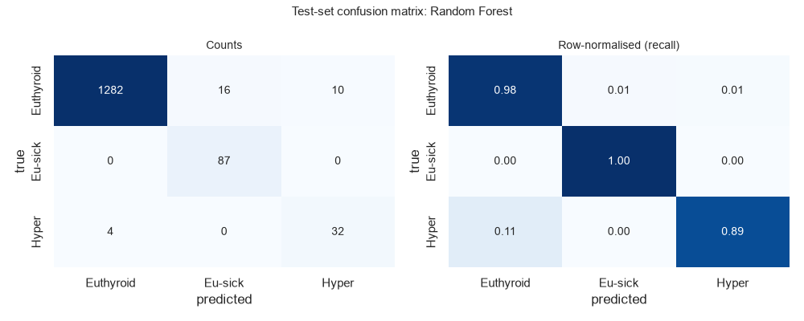
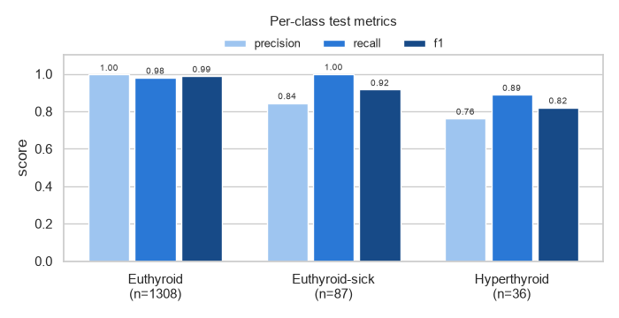
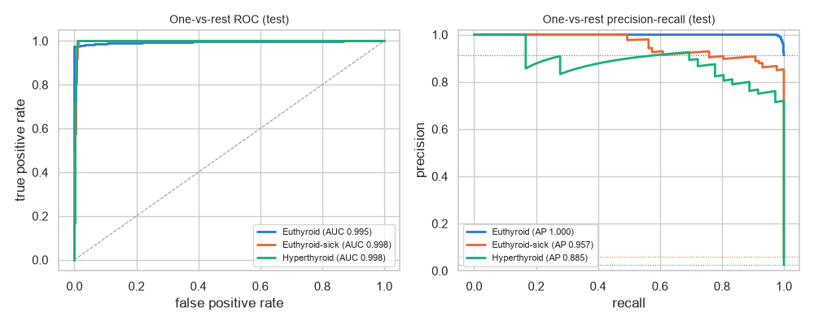
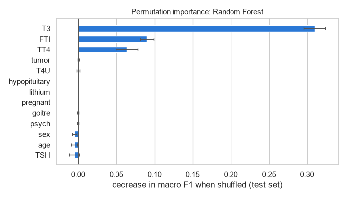
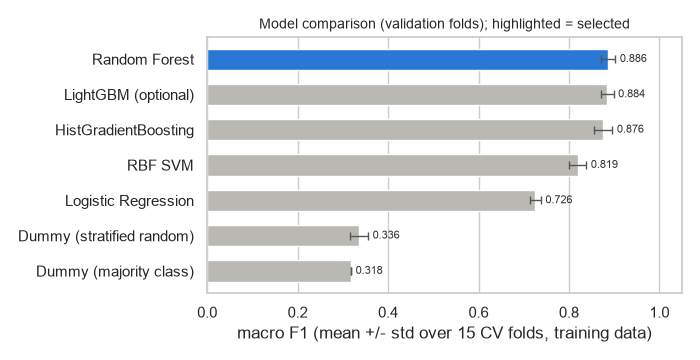

# ThyroML

ThyroML is an experimental machine-learning research project. It classifies archived thyroid laboratory records into three **derived** classes: **Hyperthyroid**, **Euthyroid-sick** and **Euthyroid**. The project is built to be reproducible and leakage-aware. One notebook, [`ThyroML.ipynb`](ThyroML.ipynb), runs top to bottom in a fresh kernel, and every number in this README is copied from its executed output or from the CSV files it writes to [`artifacts/`](artifacts).

> **ThyroML is not a medical diagnostic device.** It has not been clinically validated, and it must not be used to diagnose, treat or triage anyone. See [Responsible use](#responsible-use).

## Contents
- [Project overview](#project-overview)
- [Problem definition](#problem-definition)
- [Dataset](#dataset)
- [Derived Target Construction](#derived-target-construction)
- [Methodology](#methodology)
- [Feature engineering](#feature-engineering)
- [Validation strategy](#validation-strategy)
- [Models evaluated](#models-evaluated)
- [Evaluation metrics](#evaluation-metrics)
- [Final results](#final-results)
- [Key visualizations](#key-visualizations)
- [How to run](#how-to-run)
- [Dependencies and versions](#dependencies-and-versions)
- [Reproducibility](#reproducibility)
- [Limitations](#limitations)
- [Responsible use](#responsible-use)

## Project overview

| | |
|---|---|
| Task | 3-class tabular classification (Hyperthyroid / Euthyroid-sick / Euthyroid) |
| Data | UCI Thyroid Disease, file `thyroid0387` (Garvan Institute, Sydney, 1984-1987), 9172 records, of which 7156 were retained |
| Main model | Random Forest with class weighting, on 13 patient/laboratory features |
| Selection | macro F1 from repeated, stratified, grouped 5-fold CV on the training data only |
| Test macro F1 | 0.9082 (95 % bootstrap CI 0.8695-0.9402) on 1431 held-out records |
| Compute | CPU only; the full notebook ran in 1.0 min |

What the project emphasises:
* a transparent, documented derived target, with every dropped row accounted for;
* an audit of identifier, treatment, process and proxy columns, plus an ablation that measures what they would add;
* de-duplication and grouped splitting, so that identical inputs never appear in both train and test;
* all preprocessing fitted inside the training folds;
* a test set used exactly once, for the final report.

## Problem definition

Given one archived thyroid-function test record (age, sex, a few clinical flags and the hormone assays TSH, T3, TT4, T4U, FTI), predict the derived ThyroML class:

| Derived class | Meaning in this project |
|---|---|
| **Hyperthyroid** | The source record was coded as a hyperthyroid condition (`A`, `B`, `C` or `D`) |
| **Euthyroid-sick** | The source record was coded `K`, "concurrent non-thyroidal illness" (the euthyroid sick / non-thyroidal illness pattern) |
| **Euthyroid** | The source record was coded `-`, "no condition requiring comment" |

The classes are very imbalanced (91.4 % / 6.1 % / 2.5 %), so the main metric is **macro F1**, and recall on the two minority classes gets particular attention.

## Dataset

| Item | Value |
|---|---|
| Primary source | Quinlan, R. (1986). *Thyroid Disease* [Dataset]. UCI Machine Learning Repository. https://doi.org/10.24432/C5D010 ([dataset page](https://archive.ics.uci.edu/dataset/102/thyroid+disease)) |
| License | Creative Commons Attribution 4.0 International (CC BY 4.0), as stated on the UCI dataset page |
| File used | `thyroid0387.data` (records) and `thyroid0387.names` (documentation) from the UCI archive |
| Origin | Garvan Institute, Sydney, Australia; supplied by J. Ross Quinlan |
| Size and date range | 9172 records, 1984 to early 1987 (per `thyroid0387.names`) |
| Acquisition | Kaggle mirror [`abdelazizsami/thyroid-disease`](https://www.kaggle.com/datasets/abdelazizsami/thyroid-disease), which holds the raw UCI archive files verbatim. It is downloaded with `kagglehub` into the kagglehub cache, outside this repository. |
| Integrity | SHA-256 of `thyroid0387.data` = `4a20d104d4607afd7b1a477af5aa4381a2027f36cc7027f44bc2bd5a50c6724d`; `thyroid0387.names` = `4f0439617f6e7b456e681ff188ab0800381fcad5d3c3a5c48518f33a19f5b175`. The notebook asserts that both files are byte-identical to the same files inside the official UCI archive `thyroid+disease.zip` (downloaded 2026-10-08, archive SHA-256 `a0982569a7442c03a20815db58f271245e7a111b10ac46f6c6b5fa6feee4c1f4`). See [`artifacts/data_checksums.csv`](artifacts/data_checksums.csv). |

**Record format.** Each record has 29 attribute values followed by `diagnosis[record id]`, for example `29,F,f,...,other,-[840801013]`. `?` denotes a missing value.

**Columns.** The 29 attributes are:
* `age`, `sex`;
* 14 binary history/clinical flags: `on_thyroxine`, `query_on_thyroxine`, `on_antithyroid_medication`, `sick`, `pregnant`, `thyroid_surgery`, `I131_treatment`, `query_hypothyroid`, `query_hyperthyroid`, `lithium`, `goitre`, `tumor`, `hypopituitary`, `psych`;
* 6 `*_measured` flags, each with its value: `TSH`, `T3`, `TT4`, `T4U`, `FTI`, `TBG`;
* `referral_source`.

**Other files in the archive** (the `allbp`/`allhyper`/`allhypo`/`allrep`/`dis`/`sick` task subsets, the `ann-*` variant, `new-thyroid`, `hypothyroid`, `sick-euthyroid`) are listed in notebook Section 4 but not used.

**Inspection findings (notebook Section 4):**
* 32 distinct source codes;
* missing values: T3 28.4 %, TSH 9.2 %, TBG 96.2 %, sex 3.3 %;
* each `*_measured` flag is exactly equal to "value present";
* four implausible ages (455, 65511, 65512, 65526);
* 10 exact duplicate records in the full file.

## Derived Target Construction

1. **The original dataset contains multiple diagnosis codes.** `thyroid0387` does not have a class column. Each record carries a diagnosis string built from letters `A`-`T`, grouped by the documentation into hyperthyroid (`A-D`), hypothyroid (`E-H`), binding protein (`I-J`), general health (`K`), replacement therapy (`L-N`), antithyroid treatment (`O-Q`) and miscellaneous (`R-T`) conditions. `-` means "no condition requiring comment". Several letters can be combined (e.g. `AK`), and `X|Y` means "consistent with X, but more likely Y". The file holds 32 distinct code strings.
2. **ThyroML does not use the raw diagnosis code directly as the final target.** The code (the **source label**) is used only to construct the target, and it is never a model input.
3. **A documented mapping is applied** (configured once as `SOURCE_TO_DERIVED` in notebook Section 1):
   * `A` (hyperthyroid), `B` (T3 toxic), `C` (toxic goitre), `D` (secondary toxic) -> **Hyperthyroid**
   * `K` (concurrent non-thyroidal illness) -> **Euthyroid-sick**
   * `-` (no condition requiring comment) -> **Euthyroid**
4. **Mixed/ambiguous and unrelated codes are excluded.** The following are removed and counted, not silently dropped:
   * every multi-letter code (e.g. `AK`, `GK`, `KJ`);
   * every `X|Y` code (e.g. `C|I`, `H|K`, `D|R`);
   * every single code outside `{A, B, C, D, K, -}`.

   After the mapping, three further deterministic rules apply:
   * records with no hormone measured at all are excluded;
   * exact duplicate records are reduced to one copy;
   * records with identical attributes but conflicting labels would be dropped (none exist).
5. **The resulting three classes are Hyperthyroid, Euthyroid-sick and Euthyroid.**
6. **These labels are derived for this ML task and are not native dataset labels.** The UCI dataset does not contain the classes "Hyperthyroid", "Euthyroid-sick" or "Euthyroid". They are a ThyroML construction from the source codes, and results should be read as agreement with that construction.

**Mapping summary** ([`artifacts/mapping_summary.csv`](artifacts/mapping_summary.csv); `n_records` = records with this code in the original file, `n_retained` = records left after all cleaning steps, `% of retained` = share of the final 7156-record dataset):

| Source code | Meaning | Mapped class | Exclusion reason | n_records | n_retained | % of original | % of retained |
|---|---|---|---|---:|---:|---:|---:|
| A | hyperthyroid | Hyperthyroid | | 147 | 147 | 1.60 | 2.05 |
| B | T3 toxic | Hyperthyroid | | 21 | 21 | 0.23 | 0.29 |
| D | secondary toxic | Hyperthyroid | | 8 | 8 | 0.09 | 0.11 |
| C | toxic goitre | Hyperthyroid | | 6 | 6 | 0.07 | 0.08 |
| K | concurrent non-thyroidal illness | Euthyroid-sick | | 436 | 436 | 4.75 | 6.09 |
| - | no condition requiring comment | Euthyroid | | 6771 | 6538 | 73.82 | 91.36 |
| G | compensated hypothyroid | excluded | single code outside target scope | 359 | 0 | 3.91 | 0.00 |
| I | increased binding protein | excluded | single code outside target scope | 346 | 0 | 3.77 | 0.00 |
| F | primary hypothyroid | excluded | single code outside target scope | 233 | 0 | 2.54 | 0.00 |
| R | discordant assay results | excluded | single code outside target scope | 196 | 0 | 2.14 | 0.00 |
| L | consistent with replacement therapy | excluded | single code outside target scope | 115 | 0 | 1.25 | 0.00 |
| M | underreplaced | excluded | single code outside target scope | 111 | 0 | 1.21 | 0.00 |
| N | overreplaced | excluded | single code outside target scope | 110 | 0 | 1.20 | 0.00 |
| S | elevated TBG | excluded | single code outside target scope | 85 | 0 | 0.93 | 0.00 |
| GK | compensated hypothyroid + concurrent non-thyroidal illness | excluded | multiple concurrent codes | 49 | 0 | 0.53 | 0.00 |
| AK | hyperthyroid + concurrent non-thyroidal illness | excluded | multiple concurrent codes | 46 | 0 | 0.50 | 0.00 |
| J | decreased binding protein | excluded | single code outside target scope | 30 | 0 | 0.33 | 0.00 |
| MK | underreplaced + concurrent non-thyroidal illness | excluded | multiple concurrent codes | 16 | 0 | 0.17 | 0.00 |
| O | antithyroid drugs | excluded | single code outside target scope | 14 | 0 | 0.15 | 0.00 |
| Q | surgery | excluded | single code outside target scope | 14 | 0 | 0.15 | 0.00 |
| C\|I | consistent with toxic goitre, more likely increased binding protein | excluded | ambiguous 'X\|Y' code | 12 | 0 | 0.13 | 0.00 |
| KJ | concurrent non-thyroidal illness + decreased binding protein | excluded | multiple concurrent codes | 11 | 0 | 0.12 | 0.00 |
| GI | compensated hypothyroid + increased binding protein | excluded | multiple concurrent codes | 10 | 0 | 0.11 | 0.00 |
| H\|K | consistent with secondary hypothyroid, more likely concurrent non-thyroidal illness | excluded | ambiguous 'X\|Y' code | 8 | 0 | 0.09 | 0.00 |
| FK | primary hypothyroid + concurrent non-thyroidal illness | excluded | multiple concurrent codes | 6 | 0 | 0.07 | 0.00 |
| P | I131 treatment | excluded | single code outside target scope | 5 | 0 | 0.05 | 0.00 |
| MI | underreplaced + increased binding protein | excluded | multiple concurrent codes | 2 | 0 | 0.02 | 0.00 |
| D\|R | consistent with secondary toxic, more likely discordant assay results | excluded | ambiguous 'X\|Y' code | 1 | 0 | 0.01 | 0.00 |
| E | hypothyroid | excluded | single code outside target scope | 1 | 0 | 0.01 | 0.00 |
| GKJ | compensated hypothyroid + concurrent non-thyroidal illness + decreased binding protein | excluded | multiple concurrent codes | 1 | 0 | 0.01 | 0.00 |
| LJ | consistent with replacement therapy + decreased binding protein | excluded | multiple concurrent codes | 1 | 0 | 0.01 | 0.00 |
| OI | antithyroid drugs + increased binding protein | excluded | multiple concurrent codes | 1 | 0 | 0.01 | 0.00 |

The mapped counts before cleaning (A 147, B 21, C 6, D 8, K 436, `-` 6771) are asserted in the notebook. The 233 `-` records not retained are 231 with no hormone measured and 2 exact duplicates.

**Row accounting** ([`artifacts/row_accounting.csv`](artifacts/row_accounting.csv)):

| Step | Reason | Removed | Rows remaining |
|---|---|---:|---:|
| 0 original thyroid0387 records | | 0 | 9172 |
| 1 code mapping | excluded: single code outside target scope | 1619 | |
| 1 code mapping | excluded: multiple concurrent codes | 143 | |
| 1 code mapping | excluded: ambiguous 'X\|Y' code | 21 | |
| 1 code mapping | excluded: unparseable/unmapped code | 0 | 7389 |
| 2 lab evidence | excluded: no hormone measured | 231 | 7158 |
| 3 exact duplicates | removed: exact duplicate record | 2 | |
| 4 conflicting duplicates | removed: duplicate attributes with conflicting labels | 0 | 7156 |

Original 9172, retained 7156, excluded/removed 2016.

**Final class distribution (after exclusions and de-duplication):**

| Derived label | n | % | Source codes |
|---|---:|---:|---|
| Euthyroid | 6538 | 91.36 | - |
| Euthyroid-sick | 436 | 6.09 | K |
| Hyperthyroid | 182 | 2.54 | A, B, C, D |

**Does the derived labelling introduce ambiguity? (notebook Sections 6.1, 8 and 15.2)**
* *Identical inputs with conflicting labels:* none. This holds both on all 29 source attributes and on the 13 model features. Only 4 retained records share a model-feature vector with another record.
* *Euthyroid-sick vs Euthyroid in hormone space:* the two classes overlap heavily on TSH, TT4, T4U and FTI (77.6-91.5 % of Euthyroid-sick values fall inside the central 90 % of Euthyroid values). They are separated almost entirely by **T3**: only 2.3 % of Euthyroid-sick T3 values fall inside that range. In a 10-nearest-neighbour check, 36.6 % of a Euthyroid-sick record's neighbours are Euthyroid. So the class boundary rests on essentially one assay, and "Euthyroid-sick" here largely means "the clinic commented on a low-T3 pattern".
* *Excluded mixed codes:* `AK` records look biochemically hyperthyroid (median FTI 198, TSH 0.08), and the final model predicts 44 of 46 as Hyperthyroid. `GK`, `MK`, `FK` and most `H|K` records have low T3 and are predicted Euthyroid-sick. The three derived classes are therefore not exhaustive: real records with combined conditions would be forced into one of them.

## Methodology

1. **Acquire and verify:** download with `kagglehub`, then assert the SHA-256 checksums against the official UCI files.
2. **Inspect:** files, columns, `?` markers, codes, implausible values, duplicates.
3. **Clean (deterministic rules only, before any split):**
   * apply the code mapping and exclusions;
   * set `age > 120` to NaN (4 records);
   * convert `t/f` to `1/0` and sex `F/M` to `1/0`;
   * drop no-lab records and exact duplicates.
4. **EDA:** descriptive only, with no fitted object reused later.
5. **Audit features** and define the main feature set and the ablation sets.
6. **Split:** grouped, stratified 80/20 hold-out, then grouped, stratified CV on the training part.
7. **Train:** baselines, then four model families (plus optional LightGBM), each with class weights and a small grid tuned by CV macro F1.
8. **Select** the final model by repeated-CV macro F1, run the feature-set ablation and the single-feature proxy probe, and refit on the full training set.
9. **Evaluate:** test set once, with bootstrap and exact binomial intervals, curves and permutation importance.

Imbalance is handled with **class weights** (`class_weight="balanced"`, or `"balanced_subsample"` for the forest). No oversampling or rebalancing is done anywhere. Class weights keep each real record exactly once, need no synthetic records, and are applied automatically inside every training fit, so the validation and test folds keep their natural class mix.

## Feature engineering

Feature audit ([`artifacts/feature_audit.csv`](artifacts/feature_audit.csv)):

| Column(s) | Group | Decision | Reason |
|---|---|---|---|
| `record_id` | identifier | excluded | no predictive meaning; would enable memorisation |
| `diagnosis` | source label | excluded | the target is derived from it |
| `TSH`, `T3`, `TT4`, `T4U`, `FTI` | laboratory values | **main** | thyroid hormone measurements |
| `age`, `sex` | demographic | **main** | patient attributes (ages > 120 set to NaN) |
| `pregnant`, `lithium`, `goitre`, `tumor`, `hypopituitary`, `psych` | clinical history | **main** | patient conditions not tied to the target codes |
| `on_thyroxine`, `query_on_thyroxine`, `on_antithyroid_medication`, `I131_treatment`, `thyroid_surgery` | treatment history/decision | ablation only | past treatment decisions; linked to the excluded codes `L-Q` and they alter hormone levels |
| `sick` | target-proxy risk | ablation only | may encode the same judgement as code `K` |
| `query_hypothyroid`, `query_hyperthyroid` | process proxy | ablation only | the referring clinician's suspicion, not a measurement |
| `referral_source` | process proxy | ablation only | referral site/route, not physiology |
| `*_measured` | process proxy | ablation only (as missing indicators) | identical to missingness; encodes which tests were ordered |
| `TBG` | laboratory value | ablation only | missing in over 98 % of retained records in every class (96 % of all records) |

Transformations, all inside one scikit-learn `Pipeline` / `ColumnTransformer` and fitted on training folds only:
* **hormones:** median imputation, then `log1p` (the assays are right-skewed), then standardisation;
* **age:** median imputation, then standardisation;
* **binary flags and sex:** most-frequent imputation;
* **ablation only:** one-hot encoding for `referral_source` and `MissingIndicator` for the missingness indicators.

No missing-value indicators are used in the main model, because missingness reflects which tests were ordered (for example, T3 is missing for 27.2 % of Euthyroid records but only 2.3 % of Euthyroid-sick records). No outlier clipping is applied: extreme values such as a suppressed TSH or a very high FTI are physiologically meaningful, and the log transform limits their leverage. The only value-level rule is the fixed `age > 120 -> NaN` rule.

**Ablation (Random Forest with the selected hyper-parameters; 15 CV folds on training data; [`artifacts/ablation_cv.csv`](artifacts/ablation_cv.csv)):**

| Feature set | Input columns | CV macro F1 (mean) | std | Δ vs main | Hyperthyroid recall | Euthyroid-sick recall |
|---|---:|---:|---:|---:|---:|---:|
| **main** | 13 | 0.8863 | 0.0163 | 0.0000 | 0.8423 | 0.9790 |
| main + sick | 14 | 0.8875 | 0.0146 | +0.0012 | 0.8513 | 0.9781 |
| main + treatment history | 18 | 0.8892 | 0.0175 | +0.0029 | 0.8444 | 0.9790 |
| main + clinician query flags | 15 | 0.8878 | 0.0148 | +0.0015 | 0.8422 | 0.9781 |
| main + referral source | 14 | 0.9155 | 0.0193 | +0.0292 | 0.8468 | 0.9714 |
| main + missingness indicators | 13 | 0.8902 | 0.0148 | +0.0039 | 0.8514 | 0.9781 |
| main + TBG | 14 | 0.8858 | 0.0167 | -0.0005 | 0.8536 | 0.9781 |
| full (all source attributes) | 23 | 0.9225 | 0.0153 | +0.0362 | 0.8467 | 0.9714 |

The `sick` flag, treatment history, clinician queries and TBG add almost nothing (each change is within about one CV standard deviation). The **referral source** is the one excluded column that raises CV macro F1 clearly: 81.4 % of Euthyroid-sick records came from the `SVI` route, against 25.6 % of Euthyroid records. That gain reflects a site/process effect, not physiology, and is why `referral_source` stays out of the main model. The "full" model's higher score is not reported as a headline for the same reason.

**Single-feature proxy probe** (a depth-3 tree on one column, 5 CV folds; [`artifacts/single_feature_probe.csv`](artifacts/single_feature_probe.csv)): T3 alone reaches macro F1 0.7745 and FTI 0.5079. The strongest excluded column, `referral_source`, reaches only 0.1964. No excluded column acts as a near-perfect stand-in for the target.

## Validation strategy

**train / validation (CV folds) / test**

* **Grouping:** records with an identical main-feature vector share a group (7154 groups for 7156 records), so identical model inputs can never be on both sides of a split. Exact duplicates were already removed before splitting.
* **Test hold-out:** one fold of `StratifiedGroupKFold(n_splits=5, shuffle=True, random_state=42)`, which gives 1431 test and 5725 training records with the class mix preserved. The test set is used only in notebook Section 13.
* **Validation:**
  * hyper-parameters are tuned by `GridSearchCV` on stratified, grouped 5-fold CV of the training data (seed 42);
  * models are compared, and the ablation run, on 3 x 5 = 15 stratified, grouped folds (seeds 43, 44, 45);
  * the final model is chosen by mean CV macro F1, never by test score.

| | Train | Test | Test share % |
|---|---:|---:|---:|
| Euthyroid | 5230 | 1308 | 20.0 |
| Euthyroid-sick | 349 | 87 | 20.0 |
| Hyperthyroid | 146 | 36 | 19.8 |
| total | 5725 | 1431 | 20.0 |

## Models evaluated

All models use the main feature set and the same preprocessing pipeline. CV results are mean +/- std over the 15 evaluation folds ([`artifacts/cv_model_comparison.csv`](artifacts/cv_model_comparison.csv)):

| Model | Tuned params | Macro F1 | Balanced acc. | Weighted F1 | Accuracy | Recall Hyperthyroid | Recall Euthyroid-sick | Recall Euthyroid |
|---|---|---|---|---|---|---|---|---|
| Dummy (majority class) | | 0.318 +/- 0.000 | 0.333 +/- 0.000 | 0.872 +/- 0.000 | 0.914 +/- 0.000 | 0.000 +/- 0.000 | 0.000 +/- 0.000 | 1.000 +/- 0.000 |
| Dummy (stratified random) | | 0.336 +/- 0.020 | 0.337 +/- 0.021 | 0.838 +/- 0.006 | 0.837 +/- 0.006 | 0.048 +/- 0.044 | 0.053 +/- 0.030 | 0.912 +/- 0.004 |
| Logistic Regression | C=1.0 | 0.726 +/- 0.012 | 0.936 +/- 0.019 | 0.919 +/- 0.006 | 0.905 +/- 0.008 | 0.938 +/- 0.054 | 0.969 +/- 0.025 | 0.900 +/- 0.009 |
| **Random Forest** | max_depth=12, min_samples_leaf=3 | **0.886 +/- 0.016** | 0.932 +/- 0.022 | 0.973 +/- 0.003 | 0.972 +/- 0.003 | 0.842 +/- 0.068 | 0.979 +/- 0.022 | 0.975 +/- 0.003 |
| RBF SVM | C=100, gamma=scale | 0.819 +/- 0.019 | 0.834 +/- 0.022 | 0.959 +/- 0.004 | 0.958 +/- 0.004 | 0.705 +/- 0.083 | 0.823 +/- 0.055 | 0.974 +/- 0.004 |
| HistGradientBoosting | learning_rate=0.1, max_leaf_nodes=31 | 0.876 +/- 0.020 | 0.892 +/- 0.033 | 0.971 +/- 0.004 | 0.971 +/- 0.004 | 0.797 +/- 0.080 | 0.900 +/- 0.043 | 0.980 +/- 0.002 |
| LightGBM (optional) | learning_rate=0.03, num_leaves=31 | 0.884 +/- 0.014 | 0.925 +/- 0.021 | 0.973 +/- 0.003 | 0.972 +/- 0.003 | 0.840 +/- 0.056 | 0.958 +/- 0.028 | 0.977 +/- 0.003 |

* **Class weighting:** every model uses it (`balanced`, or `balanced_subsample` for the forest).
* **Grids:**
  * Logistic Regression: C ∈ {0.01, 0.1, 1, 10};
  * Random Forest (300 trees): max_depth ∈ {None, 12}, min_samples_leaf ∈ {1, 3};
  * RBF SVM: C ∈ {1, 10, 100, 1000}, gamma ∈ {scale, 0.03};
  * HistGradientBoosting (200 iterations): learning_rate ∈ {0.05, 0.1}, max_leaf_nodes ∈ {15, 31};
  * LightGBM (300 trees): learning_rate ∈ {0.03, 0.1}, num_leaves ∈ {15, 31}.
* **LightGBM** was tried and **dropped**. The rule was to keep it only if it beat the best core model by more than one CV standard deviation. Its gain was -0.0020, against a threshold of 0.0163.
* **Selected:** the Random Forest, which had the highest repeated-CV macro F1 (0.8863 +/- 0.0163).
* **Logistic Regression:** its high balanced accuracy but low macro F1 come from over-predicting the minority classes under balanced weights.

## Evaluation metrics

On the test set, the notebook reports:
* accuracy;
* per-class precision, recall and F1;
* macro F1 and weighted F1;
* balanced accuracy;
* the raw and row-normalised confusion matrix;
* one-vs-rest ROC-AUC (macro and per class);
* average precision per class.

Uncertainty is shown in two ways:
* **bootstrap 95 % intervals** (2000 resamples, percentile method, seed 42) for accuracy, macro F1, weighted F1, balanced accuracy, minority-class recalls and macro AUC;
* **exact Clopper-Pearson 95 % intervals** for each class recall. These stay informative when a recall is 1.0, where the bootstrap interval collapses to a single point.

## Final results

Final model: **Random Forest** (`class_weight="balanced_subsample"`, 300 trees, `max_depth=12`, `min_samples_leaf=3`). It was trained on 5725 records with the 13 main features and evaluated **once** on 1431 held-out records.

**Headline test metrics** ([`artifacts/test_metrics.csv`](artifacts/test_metrics.csv)):

| Metric | Value | 95 % CI low | 95 % CI high |
|---|---:|---:|---:|
| accuracy | 0.9790 | 0.9713 | 0.9860 |
| macro_f1 | 0.9082 | 0.8695 | 0.9402 |
| weighted_f1 | 0.9798 | 0.9726 | 0.9864 |
| balanced_accuracy | 0.9563 | 0.9192 | 0.9862 |
| recall_Hyperthyroid | 0.8889 | 0.7777 | 0.9756 |
| recall_Euthyroid-sick | 1.0000 | 1.0000 | 1.0000 |
| roc_auc_ovr_macro | 0.9968 | 0.9950 | 0.9984 |

For reference, a majority-class dummy on the same test set scores accuracy 0.9140, macro F1 0.3184 and balanced accuracy 0.3333.

**Per class** ([`artifacts/test_per_class.csv`](artifacts/test_per_class.csv)):

| Derived class | Precision | Recall | Recall exact 95 % CI | F1 | Support | ROC-AUC (OvR) | Average precision |
|---|---:|---:|---|---:|---:|---:|---:|
| Euthyroid | 0.9969 | 0.9801 | 0.9710-0.9870 | 0.9884 | 1308 | 0.9953 | 0.9996 |
| Euthyroid-sick | 0.8447 | 1.0000 | 0.9585-1.0000 | 0.9158 | 87 | 0.9975 | 0.9574 |
| Hyperthyroid | 0.7619 | 0.8889 | 0.7394-0.9689 | 0.8205 | 36 | 0.9976 | 0.8855 |

**Confusion matrix (counts; rows = true class):**

| | pred Euthyroid | pred Euthyroid-sick | pred Hyperthyroid |
|---|---:|---:|---:|
| true Euthyroid | 1282 | 16 | 10 |
| true Euthyroid-sick | 0 | 87 | 0 |
| true Hyperthyroid | 4 | 0 | 32 |

**Row-normalised (recall per true class):**

| | pred Euthyroid | pred Euthyroid-sick | pred Hyperthyroid |
|---|---:|---:|---:|
| true Euthyroid | 0.980 | 0.012 | 0.008 |
| true Euthyroid-sick | 0.000 | 1.000 | 0.000 |
| true Hyperthyroid | 0.111 | 0.000 | 0.889 |

**Permutation importance** (test set, macro-F1 drop, 20 repeats; [`artifacts/permutation_importance.csv`](artifacts/permutation_importance.csv)):
* T3: 0.3100 +/- 0.0139
* FTI: 0.0899 +/- 0.0088
* TT4: 0.0638 +/- 0.0141
* every other feature: at most 0.0004

TSH, age and sex come out slightly negative (-0.0050, -0.0049, -0.0048). TSH is clinically central for hyperthyroidism, but its information is largely shared with FTI/TT4/T3 in this model, and correlated features split importance.

**Interpretation.**
* *Agreement with CV:* the test macro F1 (0.9082) is consistent with the CV estimate (0.8863 +/- 0.0163): the CV mean lies inside the test 95 % interval.
* *Why the scores are high:* these scores were investigated, not just accepted. Identifiers, codes and proxies are excluded; duplicates are removed and grouped; preprocessing runs in-fold; the proxy probe and ablation are reported. The remaining explanation is that the source codes were assigned by clinicians reading these same assays, so the derived classes are close to functions of T3, FTI and TT4.
* *What the scores measure:* the scores show agreement with 1984-87 Garvan coding practice, not diagnostic accuracy.
* *Minority-class precision:* errors are mostly Euthyroid records flagged as a minority class (16 as Euthyroid-sick and 10 as Hyperthyroid), which lowers minority precision.
* *Interval width:* with only 36 Hyperthyroid test records, the Hyperthyroid recall interval is wide (0.7394-0.9689).

## Key visualizations

All figures are written by the notebook to `artifacts/` (dpi 100).

| | |
|---|---|
|  |  |
| Derived class distribution after cleaning | Hormone values by derived class (log scale): T3 separates Euthyroid-sick |
|  |  |
| Test confusion matrix, counts and row-normalised | Per-class test precision / recall / F1 |
|  |  |
| One-vs-rest ROC and precision-recall curves (test) | Permutation importance on the test set |
|  | |
| CV macro F1 by model (training folds) | |

## How to run

```bash
git clone https://github.com/obstinix/ThyroML.git
cd ThyroML
python -m venv .venv
# Windows: .venv\Scripts\activate    macOS/Linux: source .venv/bin/activate
pip install -r requirements.txt
python -m jupyter nbconvert --to notebook --execute --inplace --ExecutePreprocessor.timeout=1800 ThyroML.ipynb
```

Or open `ThyroML.ipynb` in Jupyter and choose *Restart & Run All*. Run it from the repository root.

The data download goes through `kagglehub`. The mirror is public, but `kagglehub` may ask for Kaggle credentials (`~/.kaggle/kaggle.json` or the `KAGGLE_USERNAME`/`KAGGLE_KEY` environment variables). Never commit that file. Data is cached by kagglehub outside the repository, and the notebook refuses to continue if the checksums do not match the official UCI files.

`artifacts/thyroml_final_pipeline.joblib` (about 2 MB) is the fitted scikit-learn pipeline, kept for inspection. Like any pickle, load it only from a source you trust, and with the same scikit-learn version.

## Dependencies and versions

Version ranges are in [`requirements.txt`](requirements.txt). The exact versions used for the committed run (from notebook Section 2 and `artifacts/run_info.json`):

| Package | Version |
|---|---|
| Python | 3.11.9 |
| numpy | 2.4.6 |
| pandas | 3.0.6 |
| scikit-learn | 1.9.1 |
| scipy | 1.17.1 |
| matplotlib | 3.11.2 |
| seaborn | 0.13.2 |
| lightgbm | 4.7.0 |
| joblib | 1.6.0 |
| kagglehub | 1.0.2 |

## Reproducibility

* **Seeds:**
  * `SEED = 42` is set once in notebook Section 1 and passed explicitly to every estimator, split, permutation and bootstrap;
  * the repeated-CV seeds are derived from it (43, 44, 45).
  * Re-running the notebook reproduces the same splits, scores and figures.
* **No hidden state:** the notebook runs top to bottom in a fresh kernel and was executed that way with `nbconvert`.
* **Hardware:**
  * Windows 11 laptop (Python reports `Windows-10-10.0.26300`), Intel64 Family 6 Model 198, 24 logical CPUs;
  * **CPU only**: a GPU was available but is irrelevant for about 7k tabular rows.
* **Runtime:** 1.0 min for the full notebook (57.9 s, recorded in `artifacts/run_info.json`).
* **Data integrity:** SHA-256 checksums are asserted at load time (see [Dataset](#dataset)).

## Limitations

* **Derived target:**
  * the three classes are a ThyroML construction from clinicians' comment codes, not native labels and not a clinical gold standard;
  * records with combined conditions (e.g. `AK`, `GK`) were excluded, so the model has never seen them, and on such inputs it still outputs one of the three classes.
* **Circularity:**
  * the source codes were assigned by people reading the same hormone values the model uses, so high scores mean the model reproduces that coding, not that it detects disease independently;
  * Euthyroid-sick is defined in practice almost entirely by low T3.
* **Old, single-site data:**
  * all records come from one Australian institute, 1984-1987;
  * assay methods, reference ranges, referral patterns and populations have changed since then, and no external validation was possible.
* **Small minority classes:** 36 Hyperthyroid and 87 Euthyroid-sick test records, so the minority-class metrics have wide intervals.
* **Scope reduction:**
  * hypothyroid, binding-protein, replacement-therapy and treatment-related records (1619 single-code records) are out of scope;
  * 231 records without any hormone value were excluded.
* **Missing data:** T3 is missing for about a quarter of Euthyroid records and is imputed with the training median; the model's behaviour on such records relies more on TT4/FTI.
* **Small grids:**
  * hyper-parameter grids are deliberately small;
  * the slight optimism of reusing the training data for tuning and for comparison applies equally to all models.

## Responsible use

ThyroML is an **experimental research ML system**, published to demonstrate a careful, reproducible tabular-ML workflow on a public dataset.
* It is **not a medical device** and makes no diagnostic, prognostic or treatment claims.
* It has not been clinically validated, prospectively evaluated or reviewed by a regulator.
* Its outputs must not be used to make or support decisions about any person's health.
* The data are de-identified historical records (1984-1987) from a single institution and may not represent other populations, laboratories or eras.
* Anyone with thyroid concerns should consult a qualified clinician.

Data: Quinlan, R. (1986). Thyroid Disease. UCI Machine Learning Repository, https://doi.org/10.24432/C5D010, CC BY 4.0. Code: released under the Unlicense (see [`LICENSE`](LICENSE)).
